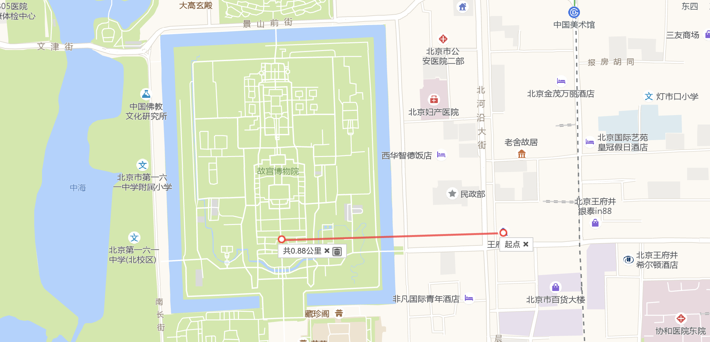

### 头条一面

4.2  星期二  37min

1. 介绍自己
2. 数据库索引的底层实现
3. 数据库索引种类，组合索引最左匹配原则
4. 数据库事务隔离级别
5. 读提交和可重复读的上锁机制
6. 编程题：翻转二叉树
7. java内存堆和栈
8. 线程安全，乐观锁与悲观锁，synchronized、lock、cas
9. 编程题：合并两个有序链表

### 头条二面

4.4    星期四    63min

1. 介绍自己，着重说项目
2. 购物车功能你怎么设计的？
3. 刚刚你说的做了网站，现在在浏览器上面输入该网站域名，如何到达指定服务器？中间用到了哪些协议？
4. 编程题：给你一个数组，你把这个数组打乱，越乱越好。编写测试用例，制定测试标准（这里和面试官探讨了很多，提了很多意见都被面试官一一反驳了，蛋疼，中间还问了我统计学置信区间相关的计算...）。
5. Math.random()函数底层实现你清楚吗？性能怎么样？
6. static修饰的变量内存初始化是怎么样的？static修饰的方法所占用的内存如何回收？
7. 方法区内存可以被回收吗？触发回收的条件是什么？
8. final底层是怎么实现的？被final修饰的变量如何重新赋值（我说了反射，面试官摇头，后来面试官说这个知识点太偏，不考了，WTF？）
9. 类加载器、双亲委派模型，为什么要用双亲委派模型？结合类加载器、双亲委派模型你知道前面static变量内存如何回收了吗？
10. 编程题：现在有一个ip地址库，每一个ip有一个ip start字段、ip end字段以及具体的Address字段，数据量大概100万，你想一下如何实现快速通过ip查询其对应的Address字段(最后没让编程，直接说思路，但顺着这个问题延展了很多，包括哈希函数的设计、哈希冲突的解决、数组、链表、HashMap，堆、二叉树、红黑树，每一种数据结构都问得很详细，包括创建过程、如何查找、时间复杂度、hashMap 中key和value应该存放什么、二叉树红黑树中每个TreeNode如何设计等)
11. redis集群和高可用的实现？
12. redis高可用中如何通过哨兵机制判断哪台服务器挂了，具体的redis命令操作是什么？
13. 你有啥问题？
14. 你以后的发展？有足够实习时间吗？
15. 总结：这次面试算得上是一次很奇特的面试了，面试官问了很多之前我没有准备的内容，比如Math.random()实现、static修饰的方法内存如何回收、方法区内存如何回收、概率论等。最后说我表现还可以，等下一面通知

### 头条三面

4.4    星期四    55min

1. 操作系统你会哪些？说一下操作系统内存管理（连续内存管理、分页内存管理、分段内存管理及其中的一些分区分配算法）
2. 说一说进程和线程(答了进程和线程关系，进程状态及状态之间如何转换)
3. 线程安全、互斥实现和非阻塞实现(答了sychronized底层原理，偏向锁、轻量级锁、重量级锁的原理和转换，Lock与sychronized的区别，以ReentrantLock为例，讲了其特性、底层代码实现，AQS，CAS，并且在将ReentrantLock的时候还对Condition进行了较为详细的讲解，引出了ArrayBlockingQueue的实现)
4. 你为什么要读这些源码(答：第一为了应付面试，第二是这些源码的设计真的十分好，而且能读下去，对着源码夸了一遍，说了一下自己的收获)
5. （算法题）二叉树的序列化与反序列化，20min

### hr面
4.12    星期五

头条的hr面不刷人，直接说实习薪资、房补、工作地点相关细节，问有没有别的offer，要不要时间考虑一下。面完之后和hr加了微信，晚上安排了导师加微信，不出意外就是实习入职的导师。给了一些学习方向和一个入职前的练手项目。

### 额外细节补充
1. 字节跳动转正很容易，和现在已经接触到的内部人员聊说转正只要保证至少60天的实习日期，就可以参与转正答辩，不太差就是能过的。转正答辩有评级，大部分是3，少量是3+，极少数是3.5，3.5为sp。

2. 字节跳动后台go语言用的比较多。面的时候问java，过了通知学习go。

3. 字节跳动相比于阿里属于比较年轻的公司，这次面的钱包交易部门，三面面试官说有很多新项目可写，新人有发展空间，让我很心动。而且一些统计数据上显示头条有50%的一线管理者都是90后，还是敢于重用年轻人的。整个公司都比较年轻的话员工之间的氛围应该会好很多。

4. 薪资待遇是国内数一数二的。

5. 字节跳动财经部门工作地点不在总部大厦，在王府井里的王府世纪，和故宫隔着一条街。要是代码写累了一抬头就能俯瞰故宫，那逼格还是很高的。
